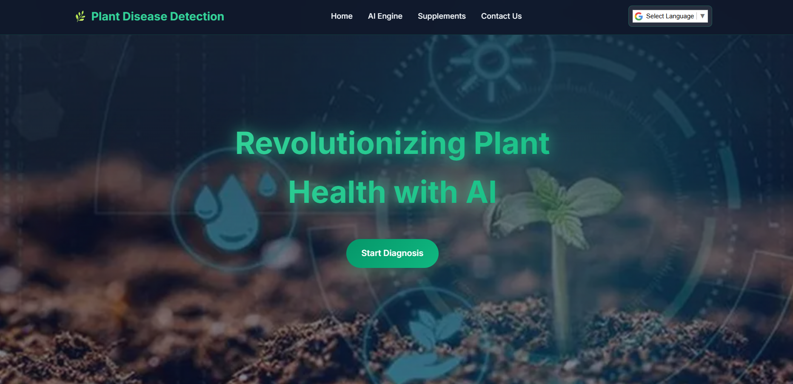
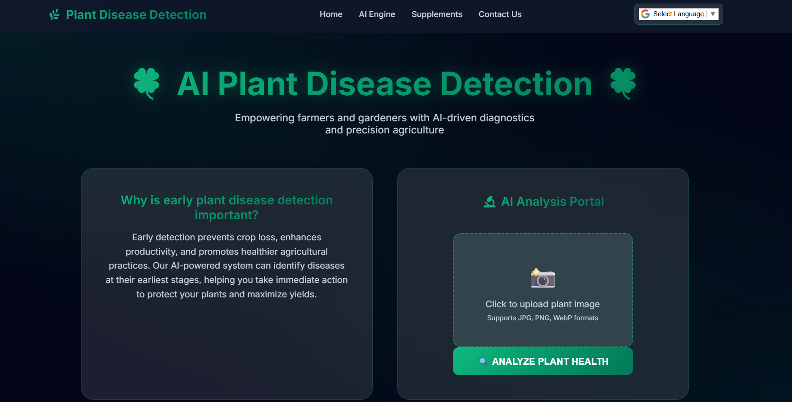
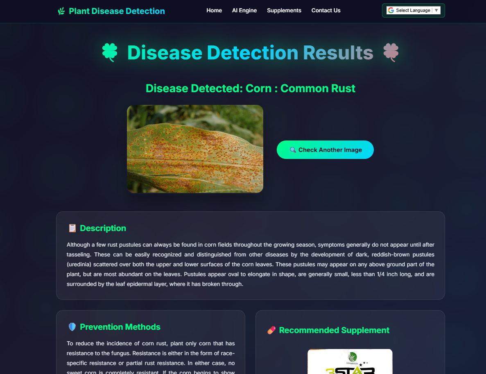
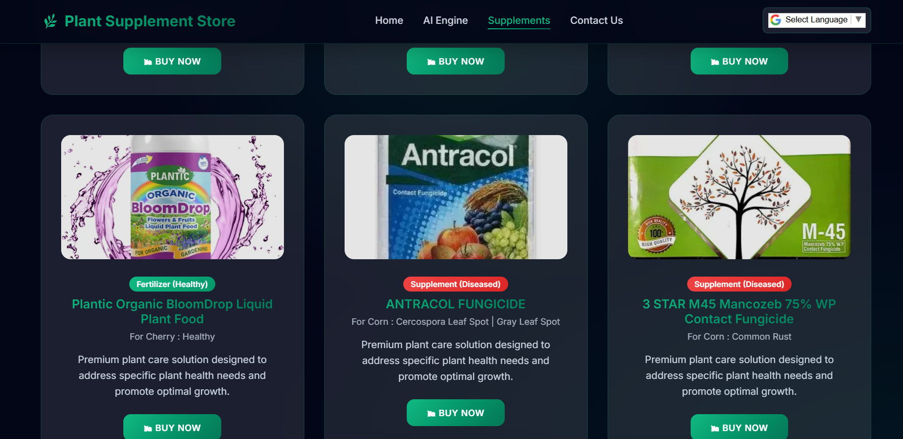

# 🌿 Plant Disease Detection - PlantDetect AI

An AI-powered web application that detects plant leaf diseases and provides detailed recommendations including causes, prevention tips, and supplements. Also features interactive tools to explore plant suitability by environment and a shopping section to directly buy fertilizers and pesticides.

---

## 🚀 Features

- 🧠 CNN-based disease detection with ~98% accuracy
- 💡 Detailed output: Disease name, cause, prevention tips, and supplement suggestions
- 🛒 Fertilizer & pesticide cart: Explore recommended products with direct purchase links
- 🗺️ Interactive crop map: View which crops grow best in different regions
- 🌱 Plant environment guide: Two interactive grids showing plants suitable for indoor and outdoor gardening

---

## 🛠️ Tech Stack

**Languages & Libraries:** Python, PyTorch, NumPy, Pandas  
**Frameworks:** Flask  
**Frontend:** HTML, CSS, JavaScript  
**Other:** Embedded product links

---

## 📁 Project Structure

Plant_Disease_Detection/  
├── static/uploads/ — Uploaded leaf images  
├── templates/ — HTML templates for frontend  
│   ├── contact-us.html — Contact form  
│   ├── home.html — Homepage with plant grids  
│   ├── index.html — Initial landing page  
│   ├── indoor.html — Indoor plant suggestions  
│   ├── outdoor.html — Outdoor plant suggestions  
│   ├── map.html — Interactive crop suitability map  
│   ├── market.html — Fertilizer/pesticide cart with purchase links  
│   ├── submit.html — Prediction results page  
├── Model/ — Contains trained model weights  
├── CNN.py — CNN model architecture and prediction logic  
├── app.py — Flask backend with routing and logic  
├── requirements.txt — Project dependencies  
├── .gitignore — Git ignore config  
└── README.md — Project documentation

---

## 📸 Screenshots

### 🏠 Home Page – Interactive Grids

---

### 🧠 AI Engine – Upload & Prediction

---

### 📋 Disease Detection Result Page

---

### 🛒 Fertilizer & Pesticide Cart

---

## 🧪 Dataset & Training

- The model was trained on a publicly available dataset of healthy and diseased leaf images
- Likely based on the PlantVillage Dataset: https://www.kaggle.com/datasets/emmarex/plantdisease
- Augmentation techniques and dropout were used during training to prevent overfitting
- Achieved ~98% accuracy on the validation set

---

## 🚀 Running Locally

1. Clone the repository:  
   `git clone https://github.com/Keshav-Kathuria/Plant_Disease_Detection.git`

2. Navigate to the project folder:  
   `cd Plant_Disease_Detection`

3. Install the dependencies:  
   `pip install -r requirements.txt`

4. Run the Flask application:  
   `python app.py`

5. Open your browser and visit:  
   `http://127.0.0.1:5000/`

---

## 🤝 Contributing

Contributions are welcome!  
Feel free to open issues, suggest improvements, or submit pull requests.

---

**Author:** Keshav Kathuria  

---

